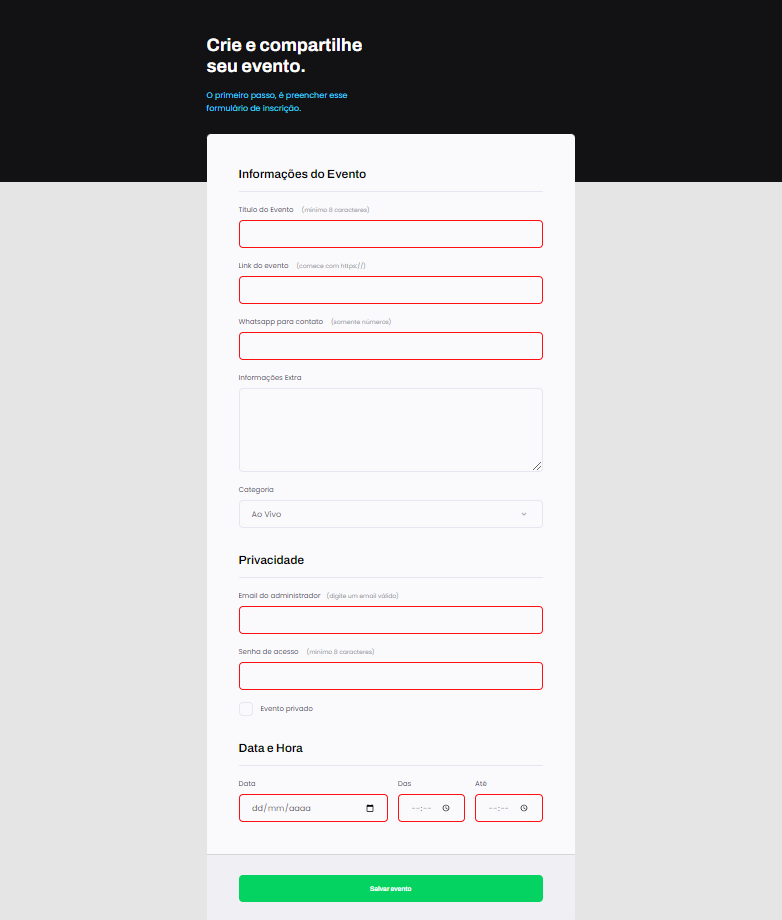
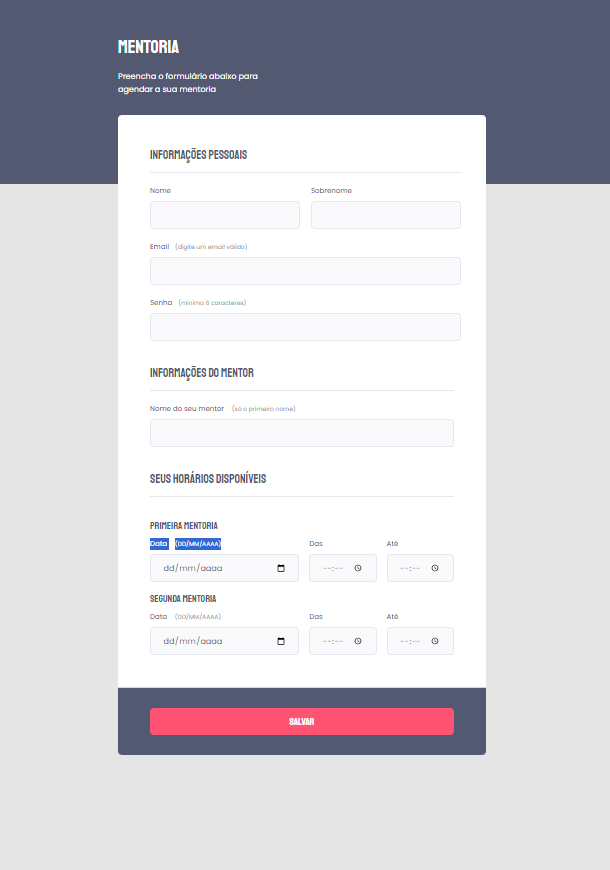

<h1 align="center">Desafio 3 recriando layout do Formulario Explorer
</h1>

## 🚀 Tecnologias

Esse projeto foi desenvolvido com as seguintes tecnologias:

- HTML
- CSS

## PRINCIPAL APRENDIZADO
estilização mais aprofundada com nth-child

- tecnicas de elemento + elemento
- base64 imagens em formato de texto
- tecnicas de ::before e ::after
## sobre
projeto desenvolvido no explorer da rocketseat

## 💻 Projeto Fotos

projeto do explorer

 
 
desafio de recriar novo formulario

 

